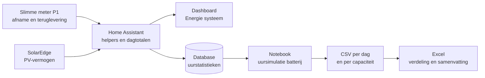

# Simulatie thuisbatterij

Deze repository bepaalt de zinvolle grootte van een thuisbatterij uit de meetgegevens van een slimme meter (P1) in Home Assistant, bij een 3-fase aansluiting met een SolarEdge PV-installatie van 9 kWp. Het werk bestaat uit twee delen: live metingen en een dashboard binnen Home Assistant zelf, en een simulatie over ruim een jaar historie in een Jupyter-notebook, met de uitkomsten uitgewerkt in Excel.

## Wat het systeem doet

Het systeem beantwoordt één vraag: hoe groot moet een thuisbatterij zijn om de zonnestroom die overdag wordt teruggeleverd zo goed mogelijk 's avonds en 's nachts zelf te gebruiken? Een te kleine batterij laat overschot liggen, een te grote staat het grootste deel van het jaar half leeg. Het antwoord hangt dus af van het eigen verbruikspatroon, en daarom werkt het systeem met gemeten data in plaats van vuistregels.

De slimme meter meet continu hoeveel stroom het huis afneemt en teruglevert. Home Assistant slaat die metingen op, berekent er dagtotalen uit en toont op een dashboard hoeveel er die dag in een batterij had gekund en hoeveel er weer uit had gekund. Dat geeft een doorlopend, actueel beeld. Voor de eigenlijke dimensionering leest een Jupyter-notebook ruim een jaar aan uurwaarden uit de Home Assistant-database en speelt per uur na wat een batterij van een bepaalde grootte zou hebben gedaan: laden zodra er stroom wordt teruggeleverd, ontladen zodra de panelen niets meer overhouden. Zo ontstaat per dag de ideale accugrootte en per batterijgrootte de hoeveelheid energie die er per jaar mee verschoven wordt. De Excel-analyse maakt die uitkomsten inzichtelijk als verdeling over het jaar en per seizoen, met instelbaar accuvermogen en rendement.

Op de eigen installatie (400 dagen data, 2,5 kW accuvermogen, 90% rendement) is de ideale accugrootte per dag gemiddeld zo'n 4 kWh, met een duidelijk seizoenspatroon: vrijwel nul in de winter en het hoogst in het voorjaar. De meeropbrengst per extra kWh capaciteit neemt boven 5 à 6 kWh snel af.

## Wat er in Home Assistant gebeurt

De slimme meter wordt via ESPHome uitgelezen en levert per fase het actuele vermogen en vier kWh-tellers: afname en teruglevering, elk op tarief 1 en 2. Die tellers zijn door de meter al over de drie fasen gesaldeerd en vormen de basis van alles. De SolarEdge-integratie levert het actuele PV-vermogen.

Bovenop deze sensoren zijn via Instellingen › Helpers een reeks hulpsensoren aangemaakt. Twee template-sensoren, "Afname totaal" en "Teruglevering totaal", tellen de twee tarieftellers bij elkaar op. Daarop draaien dagelijkse energiemeters (utility meters) die om middernacht op nul springen, zodat per dag zichtbaar is hoeveel er is afgenomen en teruggeleverd. "Netto per dag" trekt die twee van elkaar af. "Verschuifbare energie vandaag" neemt het kleinste van beide, omdat een batterij nooit meer kan ontladen dan er wordt afgenomen en nooit meer kan laden dan er wordt teruggeleverd.

Voor het verbruik op momenten dat de panelen niets leveren geeft een template-sensor het afgenomen netvermogen door zolang de SolarEdge minder dan 50 W levert, en anders nul. Een integraal-helper (Riemann-som, linkse methode) zet dat vermogen om in kWh, en een dagmeter telt het per dag op. "Ideale accugrootte vandaag" is het kleinste van de teruglevering en dit verbruik zonder PV: de hoeveelheid die een batterij die dag uit eigen overschot 's avonds en 's nachts had kunnen leveren. Een jaarlijkse energiemeter op de gasteller houdt het gasverbruik per kalenderjaar bij.

Al deze sensoren staan op het dashboard "Energie systeem", dat is ingedeeld in secties voor sturing, warmte, gas, elektriciteit en PV, de batterijanalyse en de airco. De batterijsectie toont de dagwaarden, een staafgrafiek van de ideale accugrootte over dertig dagen en een grafiek van afname en teruglevering per dag over zestig dagen. Die laatste leest rechtstreeks uit de historie van de tarieftellers en was daardoor meteen gevuld; de nieuwe hulpsensoren bouwen hun historie pas op vanaf het moment van aanmaken.

De map `homeassistant/` bevat twee bestanden om de opzet op een andere installatie na te bouwen. `thuisbatterij_package.yaml` is een YAML-package met dezelfde helpers; op de oorspronkelijke installatie zijn die via de gebruikersinterface aangemaakt, dus daar hoeft het niet geladen te worden. `dashboard_energie_systeem.yaml` is de volledige configuratie van het dashboard, die je via de raw configuration editor van een nieuw dashboard kunt plakken. De sectie met de batterijanalyse werkt zodra de helpers bestaan; de secties voor sturing, warmte en airco verwijzen naar eigen apparaten en kun je weglaten.

## De simulatie

Home Assistant bewaart van elke sensor met een statusklasse blijvend een uurstatistiek in zijn database. `batterij_simulatie_v2.ipynb` draait in de JupyterLab-add-on van Home Assistant, waar die database onder `/config` beschikbaar is, en leest de uurwaarden van de vier tarieftellers alleen-lezend uit. Uit de verschillen tussen opeenvolgende uren ontstaan per uur de afname en de teruglevering.

De notebook simuleert per uur een batterij die laadt uit teruglevering en alleen ontlaadt in uren zonder teruglevering. Dat is een strengere definitie dan de 50 W-grens op het dashboard, omdat ook uren waarin de panelen wel iets leveren maar niets overhouden als "PV uit" tellen. Accuvermogen (standaard 2,5 kW), rendement (90%) en de drempel voor "ideaal" staan bovenin als variabelen. Per dag wordt gekeken naar het venster van het eerste terugleveruur tot het eerste terugleveruur van de volgende dag, en de ideale grootte is de kleinste capaciteit die in dat venster 99% levert van wat een onbeperkt grote batterij had kunnen verschuiven. Daarnaast rekent de notebook een doorlopend jaar door voor capaciteiten van 2 tot 20 kWh. De uitkomsten verschijnen als frequentieverdeling over het jaar en per seizoen, en worden weggeschreven naar `batterij_v2_per_dag.csv` en `batterij_v2_opbrengst.csv`.

## De Excel-analyse

`thuisbatterij_analyse_v2.xlsx` bevat de dagwaarden over 400 dagen (29-08-2025 t/m 02-10-2026), een eigen Excel-berekening van de ideale accugrootte met instelbaar vermogen en rendement, histogrammen over het jaar en per seizoen en een samenvatting. De Excel-berekening werkt met dagtotalen per venster en komt goed overeen met de uursimulatie (mediaan 4,0 tegen 3,9 kWh). In de reeks zitten negen dagen zonder meetdata; de dag erna bevat telkens de ingehaalde afname in één keer.

## Gevoeligheid: rendement en vermogen van de accu

Twee extra notebooks rekenen dezelfde uursimulatie door voor batterijen van 5 tot 30 kWh. `scan_rendement_accu.ipynb` varieert het round-trip rendement van 40 tot 90% bij 2,5 kW vermogen, `scan_vermogen_accu.ipynb` het laad- en ontlaadvermogen van 1 tot 12 kW in stappen van 0,5 kW bij 80% rendement. Beide maken een scatterplot met het rendement of vermogen op de x-as, de ideale accugrootte (de grootte die op 80% van de dagen volstaat) op de y-as en een kleur per capaciteit, met daarnaast de jaaropbrengst.

Het rendement verschuift de ideale grootte weinig: van 6,3 kWh bij 90% naar 7,8 kWh bij 40%. Bij meer verlies moet je meer opslaan voor dezelfde nacht, maar komt er ook minder in de accu, en die effecten heffen elkaar grotendeels op. De jaaropbrengst daalt wel fors: een batterij van 10 kWh levert 1.455 kWh per jaar bij 90% en 1.090 kWh bij 40%. Het vermogen telt vooral onderin. Van 1 naar 2 kW stijgt de opbrengst van een batterij van 10 kWh van 1.256 naar 1.394 kWh per jaar, boven 3 kW komt er nog geen 20 kWh bij. De ideale grootte loopt mee van 5,7 naar 6,8 kWh. Vanaf 10 à 15 kWh vallen alle lijnen samen, omdat geen enkele dag meer vraagt.

## Boiler en heat pipes

`analyse_boiler_heatpipes.ipynb` analyseert een hygiëneboiler van 500 liter met 120 heat pipes op het zuiden. Uit de uurstatistieken van collector- en vattemperaturen, de bedrijfsuren van de solarpomp en de PV-opbrengst bepaalt de notebook per dag hoe warm het vat wordt en hoeveel zonnewarmte de heat pipes toevoegen. Dagen waarop warmte naar een zwembad is afgevoerd, worden herkend en buiten de kalibratie gehouden. Over 526 dagen leveren de heat pipes gemiddeld 0,46 kWh warmte per kWh PV-opbrengst, iets meer bij een koel vat en iets minder bij een warm vat. Van april tot en met september halen ze op de meeste dagen zelf 60 °C.

`homeassistant/boiler_overschot_algoritme.yaml` is een package voor de situatie na het einde van de salderingsregeling in 2027, als teruggeleverde stroom vrijwel niets meer oplevert. Het schakelt een element van 3 × 2 kW per fase op PV-overschot. De heat pipes hebben voorrang: het element verwarmt alleen wat de zon vandaag niet meer haalt, of slaat overschot op nadat de heat pipes over hun piek zijn. Een batterij gaat voor het vat tot er genoeg in zit voor de nacht. Het algoritme gebruikt drie Forecast.Solar-vlakken: oost en west voor de panelen en een virtueel zuidvlak dat de verwachte zonnewarmte voorspelt. Bij een te heet vat schakelt het een pomp in die warmte afvoert. De schakelaars voor het element zijn nog plaatshouders.

## Gebruik op een andere installatie

Benodigd is Python 3 met pandas, numpy en matplotlib (zie `requirements.txt`). Pas bovenin de notebook de entity-id's van de tarieftellers aan, en in het YAML-package ook die van het PV-vermogen en de gasteller.
